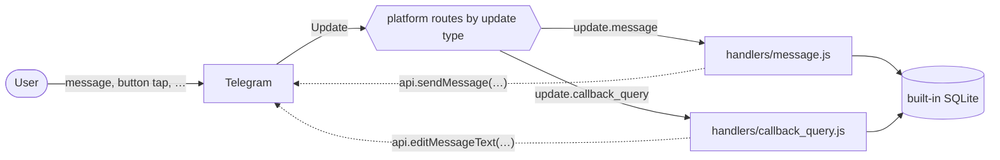
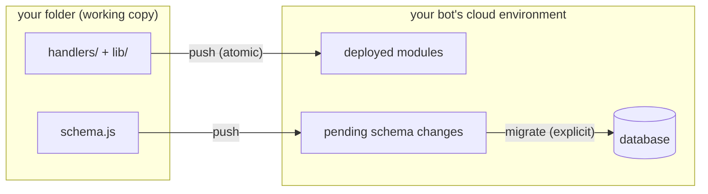

# Telegram Serverless Bot Template

An educational template for [Telegram Serverless](https://core.telegram.org/bots/serverless) — Telegram's own platform that runs your bot's backend directly on their infrastructure. You write plain JavaScript modules; the platform runs them in a V8 sandbox next to the Bot API, with a built-in SQLite database. No servers, no containers, no webhook plumbing.

The template is a small but complete **todo bot**: send it text to add a task, `/list` to see your tasks as tappable buttons, tap to toggle or delete. Small on purpose — every file exists to demonstrate one part of the platform, and each folder has its own README explaining its role:

- [handlers/README.md](handlers/README.md) — how updates enter your bot
- [lib/README.md](lib/README.md) — shared modules and the import rules
- [docs/README.md](docs/README.md) — the full SDK reference lives here

## The main principles

### 1. Your bot is a set of event handlers, not a server

There is no `main()`, no process, no event loop of yours. Telegram delivers each [update](https://core.telegram.org/bots/api#update) (a message, a button tap, a member change) to the file in `handlers/` named after the update's type — `handlers/message.js` for messages, `handlers/callback_query.js` for button taps. Each file default-exports one async function; when it resolves, the invocation is over.

The webhook is managed *for* you and derived *from* your code: the platform builds `allowed_updates` from which handler files exist. Handling a new update type is creating a file, not configuring anything.



### 2. Everything is a module, and the sandbox is not Node

Your code runs in a V8 isolate with exactly three kinds of imports, all by **bare name** — never relative paths, never `.js` extensions:

```js
import { db, api, fetch } from 'sdk';   // the platform: database, Bot API, HTTP
import { todos } from 'schema';         // your schema (root file)
import { addTodo } from 'lib/todos';    // your shared modules
```

There are no npm packages at runtime, no filesystem, and no network except `fetch` from the SDK. This sounds restrictive; it's what makes deploys instant, cold starts negligible, and every module trivially auditable. (The `@tgcloud/cli` in package.json is a local dev tool — it never ships.)

### 3. State lives in the built-in database

Handlers are stateless between invocations — a global variable won't survive. Persistent state goes in the SQLite database that ships with every bot, declared in [schema.js](schema.js) as tables and queried with a Drizzle-style builder:

```js
await db.insert(todos).values({ chatId, text }).returning().run();
await db.select().from(todos).where(eq(todos.chatId, chatId)).all();
```

Two rules that bite: **every DB call must be awaited** (a forgotten `await` returns the query builder, not rows), and **there are no foreign keys** — `.references()` throws at deploy time, so integrity is your application code's job (see how [lib/todos.js](lib/todos.js) scopes every query by `chatId`).

### 4. Code and schema change on different rhythms

`npx tgcloud push` deploys your modules atomically — and **never touches the database**. Schema changes are a separate, explicit step:

```bash
npx tgcloud push       # deploy code; reports pending DB changes, applies none
npx tgcloud migrate    # apply schema.js changes to the database
```



Destructive changes are deliberately hard: dropping a column or table happens only by marking it `.deprecated('reason')` in schema.js — deleting the declaration drops nothing. This asymmetry (code moves fast, data moves carefully) is the same discipline production teams enforce by convention; here the platform enforces it.

### 5. The cloud is a shared truth you sync with

The deployed bot is the source of truth; your folder is a working copy. `push` is rejected if someone else deployed since you last synced (like a git push to a moved branch) — `status`, `diff`, `fetch`, and `pull` reconcile, `--force` overwrites deliberately. The `.tgcloud/` folder is the CLI's private state for all this: gitignored, never edited by hand.

## Quick start

1. Create a bot with [@BotFather](https://t.me/BotFather) (or pick an existing one) and enable **Serverless** for it.
2. Link and deploy:

   ```bash
   npm install
   npx tgcloud login      # links this folder to your bot
   npx tgcloud push       # deploy the modules
   npx tgcloud migrate    # create the tables
   ```

3. Message your bot: any text adds a todo, `/list` shows the list, buttons toggle/delete.

## A guided tour (suggested reading order)

1. [schema.js](schema.js) — two tables, an index, timestamp defaults, and why there's no foreign key.
2. [handlers/message.js](handlers/message.js) — command routing, including the `/cmd@botname` form used in groups.
3. [lib/todos.js](lib/todos.js) — the queries, and `renderList()`: one function that both handlers use to draw the list, embedding `toggle:<id>` / `delete:<id>` into the buttons' `callback_data`.
4. [handlers/callback_query.js](handlers/callback_query.js) — the other side of that contract: answer the callback, mutate, re-render the message in place, and swallow exactly one expected Bot API error.
5. [lib/users.js](lib/users.js) — an idempotent upsert (`onConflictDoUpdate`).

Then skim [docs/tgcloud-sdk.md](docs/tgcloud-sdk.md) for the full API surface, and [AGENTS.md](AGENTS.md) for the condensed rules (that file is auto-loaded by AI coding tools working in this repo).

## Everyday commands

```bash
npx tgcloud status               # what changed locally vs the cloud
npx tgcloud diff                 # line-by-line diff of changed modules
npx tgcloud push                 # deploy (rejects if the cloud moved; --force overrides)
npx tgcloud migrate              # apply schema changes (--dry-run to preview)
npx tgcloud run handlers/message '{ chat: { id: 1 }, text: "hi" }'
                                 # execute a handler server-side with a fake payload
npx tgcloud add handlers/inline_query   # scaffold a new handler
npx tgcloud webhook              # inspect webhook state; `webhook sync` repairs drift
```

npm shortcuts: `npm run deploy`, `npm run status`, `npm run migrate`.

## Platform limits worth knowing up front

- Bot API calls via `api.<method>()` return the **unwrapped** result and throw `BotApiError` on failure (`.code`, `.description`, `.parameters` — e.g. `retry_after` on a 429).
- File bytes can't be downloaded or uploaded from a handler yet — pass `file_id`s around instead.
- `fetch` responses are textual only, capped at 32 MB total.
- Deployed surface is exactly: `schema.js`, `.js` files in `lib/` and `handlers/`. Markdown (including every README here), dotfiles, and `.tgcloud/` stay local.
